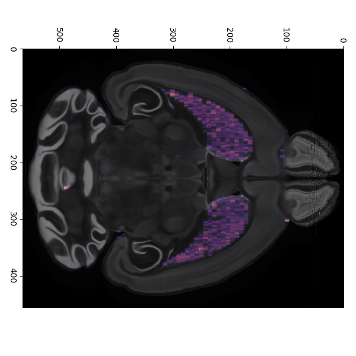

This directory contains examples for using spatial brain maps. It assumes you have spatial brain maps installed. You can either install from the github repository by running 
```bash
pip install -e .  
```
in the top directory of the repository or you can install the latest official version from pip with
```bash
pip install spatial-brain-maps  
```

creating_3d_volumes.py will show you how we generated the volumes used in the paper and for the CArea atlas. 

plot_with_brainglobe.py will show you how to use our volumes alongside a brainglobe-atlasapi atlas for plotting the below horizontal section. 


